# Pathfinder 2e Godot Engine

This is a custom-built, data-driven Pathfinder 2e engine implemented in Godot 4 using GDScript and a local SQLite database.

## System Architecture

The engine is built around a highly relational, data-first architecture. It prioritizes using strict Enums (like `ActionCost`, `MagicTradition`, `Distance`) to keep memory low and database queries lightning fast.

Here is a high-level view of the core engine components and their relationships:

```mermaid
classDiagram
    %% Core Entities (Data)
    class PFEntity {
        <<Base Class (RefCounted)>>
        +StringName id
        +String entity_name
        +Array traits
        +Rarity rarity
    }
    
    class PFDatabase {
        <<Singleton (Node)>>
        +SQLite db
        +get_pf_spell(id) PFSpell
        +get_pf_class(id) PFClass
    }

    class PFGameRoot {
        <<Singleton (Node)>>
        +current_context
    }

    %% Base Actor (Node3D)
    class PFActor {
        <<Base Class (Node3D)>>
        +PFEntity core
        +String entity_name
        +int level
        +Array traits
        +Rarity rarity
        +PFHealthComponent health
        +PFActionComponent action_economy
        +Array conditions
        +get_ac() int
        +get_strike_bonus(PFWeapon) int
        +get_spell_dc() int
    }
    PFActor *-- PFEntity : composes
    
    %% Hybrid Inheritance
    class PFPlayerCharacter {
        +PFProficiencySheet sheet
        +PFInventory inventory
        +PFSpellbook spellbook
        +PFAttributesComponent attributes
        +PFMovementComponent movement
        +PFSensesComponent senses
        +get_ac() int
    }
    PFActor <|-- PFPlayerCharacter

    class PFNpc {
        +Dictionary monster_stats
        +PFInventory inventory
        +PFSpellbook spellbook
        +PFAttributesComponent attributes
        +PFMovementComponent movement
        +PFSensesComponent senses
        +get_ac() int
    }
    PFActor <|-- PFNpc

    class PFConstruct {
        +int hardness
        +int broken_threshold
        +take_damage(amount, type)
    }
    PFActor <|-- PFConstruct

    class PFMinion {
        +PFActor master
        +receive_command()
    }
    PFNpc <|-- PFMinion

    class PFAnimalCompanion {
        +String companion_type
        +support_benefit()
        +advanced_maneuver()
    }
    PFMinion <|-- PFAnimalCompanion

    class PFFamiliar {
        +Array familiar_abilities
        +Array master_abilities
        +update_stats_from_master()
    }
    PFMinion <|-- PFFamiliar

    %% Components
    class PFComponent {
        <<Component (Node)>>
    }

    class PFHealthComponent {
        <<Component>>
        +int current_hp
        +int max_hp
    }
    PFComponent <|-- PFHealthComponent

    class PFActionComponent {
        <<Component>>
        +int actions_remaining
        +int reactions_remaining
    }
    PFComponent <|-- PFActionComponent

    class PFProficiencySheet {
        <<Component (RefCounted)>>
        +int level
        +calculate_proficiency()
    }
    PFPlayerCharacter *-- PFProficiencySheet : owns

    class PFInventory {
        <<Component (RefCounted)>>
        +Array items
        +int copper_pieces
        +get_total_bulk() int
    }
    
    %% Magic
    class PFSpell {
        +int base_spell_rank
        +Array traditions
        +Array variants
        +get_damage_dice(actions) int
    }
    PFEntity <|-- PFSpell
    
    class PFSpellVariant {
        <<Resource (RefCounted)>>
        +ActionCost action_cost
        +Distance spell_range
        +int damage_dice
        +Array applied_conditions
    }
    PFSpell *-- PFSpellVariant : contains

    %% Items
    class PFItem {
        +int bulk
        +int price_cp
    }
    PFEntity <|-- PFItem
    
    class PFWeapon {
        +int damage_dice
        +int damage_faces
    }
    PFItem <|-- PFWeapon

    class PFArmor {
        +int ac_bonus
        +int dex_cap
    }
    PFItem <|-- PFArmor

    class PFShield {
        +int ac_bonus
        +int hardness
        +int max_hp
    }
    PFItem <|-- PFShield
    
    %% Actions
    class PFAction {
        +ActionCost cost
        +int map_weight
        +execute(user, target) bool
    }
    PFEntity <|-- PFAction
    
    %% Conditions
    class PFCondition {
        <<RefCounted>>
        +String condition_id
        +String condition_name
        +int value
        +get_modifier(context) int
    }
    PFActor *-- PFCondition : holds

    %% Contexts
    class PFContext {
        <<Base Context (Node)>>
    }
    class PFCombatContext {
    }
    class PFOverworldContext {
    }
    class PFMainMenuContext {
    }
    PFContext <|-- PFCombatContext
    PFContext <|-- PFOverworldContext
    PFContext <|-- PFMainMenuContext

    %% Combat & Systems
    class PFCombatGrid {
        <<Manager (Node3D)>>
        +MultiMeshInstance3D multimesh_instance
        +draw_base_grid(width, height)
        +highlight_tiles(tiles, color)
    }

    class PFCameraRig {
        <<3D Controller (Node3D)>>
        +float target_zoom
        +float target_rotation_y
        +focus_on_position(pos)
    }
    
    class PFActionMenu {
        <<UI Controller (Control)>>
        +MenuPosition menu_position
        +bind_to_actor(PFActor)
    }
```

## Highlights
- **2.5D Rendering:** Uses Orthographic `Camera3D` and `Sprite3D` billboarding to emulate an HD-2D aesthetic (Triangle Strategy/Octopath).
- **High Performance Grid:** Uses highly optimized `MultiMeshInstance3D` to draw thousands of tactical highlights in a single draw call.
- **Database Driven:** `PFDatabase` seeds and queries a local `pf2e_data.db` SQLite file. Schema changes are strictly managed.
- **Relational Spell Variants:** Spells dynamically morph their behavior (range, damage, conditions) based on the number of actions used to cast them, handled cleanly by the `PFSpellVariant` object.
- **Component Architecture:** Actors utilize a decoupled component model (`PFAttributesComponent`, `PFHealthComponent`, `PFActionComponent`) to avoid monolithic classes. 
- **Polymorphic Unified Math:** Systems request combat math (e.g. `get_ac()`) from the base `PFActor`, and the subclass (`PFPlayerCharacter` or `PFNpc`) handles its unique calculation (Proficiency Matrix vs GMG Monster Scaling).
- **Master Spellbook:** A single `PFSpellbook` manager tracks complex multi-class spell progressions, feats, innate spells, and extra slots simultaneously.
