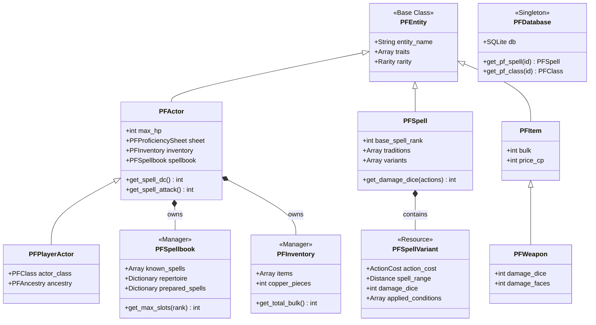

# Pathfinder 2e Godot Engine

This is a custom-built, data-driven Pathfinder 2e engine implemented in Godot 4 using GDScript and a local SQLite database.

## System Architecture

The engine is built around a highly relational, data-first architecture. It prioritizes using strict Enums (like `ActionCost`, `MagicTradition`, `Distance`) to keep memory low and database queries lightning fast.

Here is a high-level view of the core engine components and their relationships:

## Highlights
- **Database Driven:** `PFDatabase` seeds and queries a local `pf2e_data.db` SQLite file. Schema changes are strictly managed.
- **Relational Spell Variants:** Spells dynamically morph their behavior (range, damage, conditions) based on the number of actions used to cast them, handled cleanly by the `PFSpellVariant` object.
- **Master Spellbook:** A single `PFSpellbook` manager tracks complex multi-class spell progressions, feats, innate spells, and extra slots simultaneously.
- **Monster Optimization:** NPCs completely bypass expensive proficiency matrix calculations for instantaneous processing.
