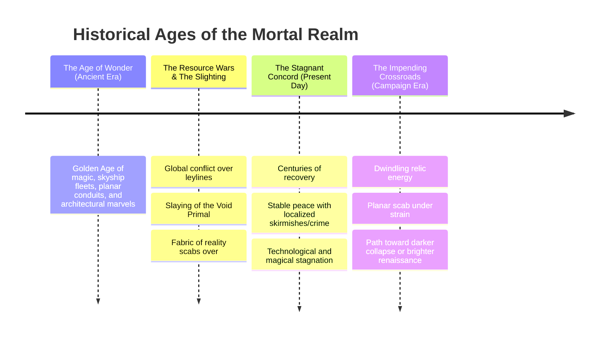

# WORLD BIBLE & CAMPAIGN LORE

## 1. Narrative Pillars & Tonal Framework

### Tonal Spectrum: Heroic Realism & Melancholic Gray
The setting balances dark, complex realism with genuine heroic idealism, drawing inspiration from *Frieren: Beyond Journey's End*, *Dragon Age: Origins*, *Elden Ring*, *Dark Souls*, *The Lord of the Rings*, and *Don Quixote*.

* **No "Evil for the Sake of Evil":** Factions and empires do not act out of cartoonish malice. Conflicts are driven by competing survival needs, resource scarcity, ancestral grievances, and conflicting visions for the world's future.
* **Heroism on All Sides:** War features noble, tragic, and heroic figures on every side of the front lines. Antagonists are often people fighting fiercely for their own folk, driven by love, duty, or noble desperation.
* **The Noble Folly:** Ideals matter. Characters can make heroic last stands for the common folk, and tragic heroes may tilt at windmills, pursuing lost causes out of sheer conviction.
* **Fading Wonder & Stagnation:** The world is built upon the ruins of a lost golden age. Magic is stagnant, ancient airships are irreplaceable relics, and the world sits at a crossroads where it will either succumb to a slow, unraveling decay or fight its way into a new era.

---

## 2. Party & Avatar Architecture

### Character Creation & Companion Agency
* **Single Custom Avatar:** The player creates only their own central main character (Avatar). All other party members are pre-authored, recruitable companions with distinct backgrounds, ancestral ties, personal quests, and ideological alignments.
* **Companion Approval & Conflict System:** Companions react dynamically to player choices throughout the narrative. Decisions—such as choosing to support Cordoval or Torvalla, executing prisoners, or making deals with dark aspects—modify companion approval. If a player's choices severely violate a companion's core convictions, that companion can object, leave the party, or even turn hostile in critical moments.

---

## 3. Cosmological Framework & Divine Matrix

### Primals vs. The 13

* **The Primals (Fundamental Forces):** Primordial, unyielding forces of nature (Fire, Water, Earth, Air, Growth, Shadow, Void) that exist across all planes. They operate purely according to their elemental nature without mortal concepts of morality, good, or evil.
* **Angels & Demons (Planar Confluences):** Neither angels nor demons are inherently divine creations of the 13. Instead, they are the natural offspring of Primals, born at planar intersections where pure elemental forces collide and merge (e.g., Fire + Growth = Fiery Fiends/Demons; Air + Light = Celestial Beings/Angels).
* **The 13 Deities (Supreme Scholars of the Domains):** The 13 are the most powerful non-primal entities in existence, but **they do not own or control their respective domains**. Rather, they study, manipulate, and tap into them on a transcendent scale—much like archmages or ancient druids tapping into primal leylines, but elevated to godhood.
  * **Planar Vulnerability:** The 13 are not omnipotent. If Morwenna (whose domains include *darkness*, *repose*, *sorrow*, and *soul*) were to travel directly into the Primal Realm of Shadow, ancient Shadow Primals could challenge or overpower her, though slaying a deity remains an epoch-level ordeal.
  * **Deities Cannot Create or Destroy Souls:** Souls are fundamental cosmic phenomena. No deity possesses the authority or capability to manufacture a soul from nothing or utterly annihilate one.

### The Law of the Final Veil & The Afterlife

* **Not "Morwenna's Afterlife":** The afterlife is an intrinsic, cosmic reality beyond the mortal sphere—it does not belong to Morwenna or any other deity. Morwenna is not the creator of the cycle of life and death; she is its most dedicated student and guide, having spent her entire existence studying the boundary of the Final Veil.
* **The Transitory Window & Resurrection:** When a mortal dies, their soul lingers briefly in the mortal realm. During this transitory window before crossing the Veil, resurrection magic and healing rites can call the soul back to the living vessel.
* **The Final Veil:** Once a soul crosses the threshold of the Final Veil into the true afterlife, the boundary is absolute. Even the greatest death deities, including Morwenna, cannot cross it, alter its course, or retrieve a soul that has passed beyond.

### Avatar & Aspect Mechanics
Deities cannot manifest their full cosmic forms in the mortal realm without causing cataclysmic, reality-warping collateral damage. Instead, they operate through:
1. **Mortal Worshipers & Clergy:** Granting divine spells and guidance.
2. **Aspects & Avatars:** Fragmented mortal incarnations with distinct personalities sent to execute specific tasks. The 13 frequently run multiple concurrent plans through different aspects, which can occasionally result in separate aspects of the same deity inadvertently aiding or obstructing one another's goals.

### Religious Practice: Everyday Polytheism & Civic Worship
Religion across the continent is practical, polytheistic, and domain-centric. While dedicated champions and clerics devote themselves to a single patron deity, common folk and institutions call upon whichever member of the 13 governs the moment's need:

* **Situational & Occupational Prayers:**
  * **Hunters & Trackers** offer prayers and token prey offerings to **Vurrok** before entering deep woods.
  * **Wetnurses, Midwives, and Birthing Doctors** invoke **Corvyna** for safe labor, blood health, and child survival.
  * **Sailors, Fishermen, & Navigators** make dual offerings at sea—to **Tavrin** for favorable winds and safe routes, and to **Bathyos** to placate lightless deep-sea horrors.
  * **Builders, Masons, & Guildmasters** lay cornerstone offerings to **Brada** before raising cathedrals, aqueducts, or bridges.
  * **Scholars, Astrologers, & Chronomancers** dedicate celestial calculations to **Aethelis**.
  * **Mourners and Morticians** light pale lanterns for **Morwenna** to ensure gentle transit to the Veil.
* **State & Civic Ceremonies:**
  * Imperial accessions, coronations, and martial appointments incorporate state offerings to **Stryvan** (for ambition and righteous rule) or **Kraghtor** (for strength, authority, and conquest).
  * Legal proceedings and sworn treaties are consecrated under the stern gaze of **Severin**.
* **National Patrons & Monolatry:** Major nations often adopt specific patron deities (e.g., Cordoval elevates Brada and Kaldian; Torvalla elevates Kraghtor and Severin), dedicating monumental temples to them while maintaining smaller civic shrines to the other members of the pantheon.

### The Pantheon of 13

#### 1. Aethelis (The Cosmic Weaver)
* **Title & Core Essence:** The Cosmic Weaver — *A distant, calculating observer of the tapestry of reality, Aethelis is not prayed to for mercy, but for understanding.*
* **Religious Symbol:** Hourglass | **Sacred Animal:** Owl | **Sacred Colors:** Grey, Blue
* **Favored Weapon:** Staff | **Divine Skill:** Arcana | **Divine Attributes:** Intelligence, Wisdom
* **Divine Font:** *Harm* or *Heal* | **Divine Sanctification:** Unsanctified
* **Domains:** Fate, Magic, Star, Time | **Alternate Domains:** Knowledge, Void
* **Cleric Spells:** 1st: *Sure Strike*, 2nd: *Augury*, 3rd: *Haste*
* **Edicts:** Study the cosmos and ancient magical lore, accept the natural flow of time, recognize cosmic patterns.
* **Anathema:** Destroy historical records, act blindly without forethought, attempt to rewrite the unchangeable past.
* **Divine Boons & Curses:**
  * *Minor Boon:* Once per day, roll twice on a check and take the higher result.
  * *Moderate Boon:* Cast *Haste* once per day as a divine innate spell.
  * *Major Boon:* Cast *Time Stop* once per day as a divine innate spell.
  * *Minor Curse:* Time slows around you; take a -2 penalty to initiative rolls.
  * *Moderate Curse:* You are slowed 1 during the first round of every combat.
  * *Major Curse:* You age rapidly, taking a permanent -2 penalty to physical attributes.

#### 2. Kaldian (The Sunlit Warden)
* **Title & Core Essence:** The Sunlit Warden — *A militant guardian deity of the dawn, Kaldian bears the cosmic burns of battling ancient, primordial horrors to keep the mortal realm safe.*
* **Religious Symbol:** Rising Sun | **Sacred Animal:** Dog | **Sacred Colors:** Red, Gold
* **Favored Weapon:** Bastard Sword | **Divine Skill:** Survival | **Divine Attributes:** Strength, Constitution
* **Divine Font:** *Heal* | **Divine Sanctification:** Must choose Holy
* **Domains:** Duty, Fire, Protection, Sun | **Alternate Domains:** Healing, Might
* **Cleric Spells:** 1st: *Breathe Fire*, 2nd: *Floating Flame*, 3rd: *Fireball*
* **Edicts:** Protect the weak and defenseless, confront primordial horrors directly, greet every dawn with vigilance, stand your ground against overwhelming odds.
* **Anathema:** Flee cowardly from battle, allow monsters to prey on innocents, extinguish sacred flames.
* **Divine Boons & Curses:**
  * *Minor Boon:* Your weapons shed bright light in a 20-foot radius.
  * *Moderate Boon:* You gain fire resistance 5.
  * *Major Boon:* Cast *Sunburst* once per day as a divine innate spell.
  * *Minor Curse:* You are blinded by the morning light for 1 minute upon waking.
  * *Moderate Curse:* You take double damage from cold and darkness effects.
  * *Major Curse:* You spontaneously combust, taking 10d6 fire damage every day at dawn.

#### 3. Cankros (The Whispering Blight)
* **Title & Core Essence:** The Whispering Blight — *An ancient, terrifying entity embodying the inevitable rot of the world, decay, and cyclical rebirth through decomposition.*
* **Religious Symbol:** Decomposing Skull | **Sacred Animal:** Locust | **Sacred Colors:** Green, Black
* **Favored Weapon:** Injection Spear | **Divine Skill:** Occultism | **Divine Attributes:** Constitution, Wisdom
* **Divine Font:** *Harm* | **Divine Sanctification:** Must choose Unholy
* **Domains:** Death, Decay, Plague, Swarm | **Alternate Domains:** Pain, Undeath
* **Cleric Spells:** 1st: *Enfeeble*, 3rd: *Stinking Cloud*, 5th: *Toxic Cloud*
* **Edicts:** Allow organic rot to run its course, spread transformative sickness, embrace physical and societal decay as fertile ground for rebirth.
* **Anathema:** Cure diseases without demanding a heavy toll, preserve corpses artificially against decay, construct permanent stone monuments meant to defy erosion.
* **Divine Boons & Curses:**
  * *Minor Boon:* You gain resistance 2 to poison.
  * *Moderate Boon:* Your touch inflicts a debilitating, flesh-wasting disease.
  * *Major Boon:* Cast *Horrid Wilting* once per day.
  * *Minor Curse:* Food and rations rot immediately in your presence.
  * *Moderate Curse:* You emit a foul stench of decay, taking a -2 penalty to Diplomacy.
  * *Major Curse:* You become a permanent plague carrier, infecting allies and bystanders.

#### 4. Tavrin (The Laughing Vagabond)
* **Title & Core Essence:** The Laughing Vagabond — *A trickster god of the open road, the rolling dice, and the bottom of a wine glass.*
* **Religious Symbol:** Pair of Ivory Dice | **Sacred Animal:** Mouse | **Sacred Colors:** Brown, Yellow
* **Favored Weapon:** Battle Lute | **Divine Skill:** Diplomacy | **Divine Attributes:** Dexterity, Charisma
* **Divine Font:** *Harm* or *Heal* | **Divine Sanctification:** Unsanctified
* **Domains:** Freedom, Indulgence, Luck, Travel | **Alternate Domains:** Confidence, Passion
* **Cleric Spells:** 1st: *Fleet Step*, 2nd: *Blur*, 4th: *Translocate*
* **Edicts:** Travel down an unfamiliar road, trust in chance and fate, share a song or tale with strangers, defy tyrants and authoritarian decrees.
* **Anathema:** Own permanent immovable property, refuse a high-stakes gamble or wager, enforce rigid authoritarian laws.
* **Divine Boons & Curses:**
  * *Minor Boon:* You gain a +10-foot status bonus to your Speed.
  * *Moderate Boon:* Cast *Dimension Door* once per day.
  * *Major Boon:* Cast *Teleport* once per day.
  * *Minor Curse:* You can never sleep in the same bed twice.
  * *Moderate Curse:* You become disoriented easily, taking a -4 penalty to Survival checks to navigate.
  * *Major Curse:* You are cursed to wander forever, unable to stay in one settlement for more than a day.

#### 5. Brada (The Iron Architect)
* **Title & Core Essence:** The Iron Architect — *The patron of builders, masons, and the relentless flow of coin that binds civilizations together.*
* **Religious Symbol:** Golden Abacus | **Sacred Animal:** Mole | **Sacred Colors:** Silver, Copper
* **Favored Weapon:** Warhammer | **Divine Skill:** Society | **Divine Attributes:** Strength, Intelligence
* **Divine Font:** *Harm* or *Heal* | **Divine Sanctification:** Unsanctified
* **Domains:** Cities, Creation, Earth, Wealth | **Alternate Domains:** Duty, Perfection
* **Cleric Spells:** 1st: *Mending*, 3rd: *Earthbind*, 5th: *Wall of Stone*
* **Edicts:** Build enduring structures and infrastructure, engage in honest fair trade, respect civic laws and municipal codes, invest personal wealth back into civilization.
* **Anathema:** Destroy functional buildings without cause, break a notarized contract, hoard idle wealth without circulating it.
* **Divine Boons & Curses:**
  * *Minor Boon:* You can appraise the exact market value of any item flawlessly.
  * *Moderate Boon:* You gain resistance 5 to physical damage.
  * *Major Boon:* Cast *Earthquake* once per day.
  * *Minor Curse:* You must pay an exorbitant toll to cross any bridge or enter any city gate.
  * *Moderate Curse:* You become obsessively greedy, unable to part with coins or goods.
  * *Major Curse:* Your flesh petrifies, permanently turning you into stone.

#### 6. Kragthor (The Storm-Crowned Tyrant)
* **Title & Core Essence:** The Storm-Crowned Tyrant — *A brutal deity of subjugation and the destructive, uncaring power of the hurricane.*
* **Religious Symbol:** Raging Storm Cloud | **Sacred Animal:** Hawk | **Sacred Colors:** Yellow, Green
* **Favored Weapon:** Greatpick | **Divine Skill:** Athletics | **Divine Attributes:** Strength, Charisma
* **Divine Font:** *Harm* | **Divine Sanctification:** Unholy Allowed
* **Domains:** Air, Destruction, Lightning, Tyranny | **Alternate Domains:** Might, Water
* **Cleric Spells:** 1st: *Thunderstrike*, 3rd: *Lightning Bolt*, 6th: *Chain Lightning*
* **Edicts:** Crush political and martial opposition, inspire terror in subordinates, strike foes without warning.
* **Anathema:** Show unearned mercy to a defeated foe, allow an insult to go unpunished, submit willingly to someone weaker than yourself.
* **Divine Boons & Curses:**
  * *Minor Boon:* Deal 1d6 electricity damage with an unarmed touch.
  * *Moderate Boon:* You gain electricity resistance 5.
  * *Major Boon:* Cast *Chain Lightning* once per day.
  * *Minor Curse:* Static electricity constantly arcs from your fingertips, disrupting fine tasks.
  * *Moderate Curse:* You attract lightning strikes during outdoor storms.
  * *Major Curse:* You are permanently deafened by the deafening sound of phantom thunder.

#### 7. Morwenna (The Veiled Mourner)
* **Title & Core Essence:** The Veiled Mourner — *A quiet, somber deity who guides souls to the Final Veil and comforts those left behind.*
* **Religious Symbol:** Burning Incense | **Sacred Animal:** Raven | **Sacred Colors:** Black, White
* **Favored Weapon:** Rope Dart | **Divine Skill:** Religion | **Divine Attributes:** Wisdom, Charisma
* **Divine Font:** *Heal* | **Divine Sanctification:** Holy Allowed
* **Domains:** Darkness, Repose, Sorrow, Soul | **Alternate Domains:** Cold, Healing
* **Cleric Spells:** 1st: *Sanctuary*, 2nd: *Peaceful Rest*, 9th: *Seize Soul*
* **Edicts:** Comfort the grieving, ensure proper burial rites for the fallen, embrace quiet contemplation and silence.
* **Anathema:** Deny a mortal their rightful period of mourning, force artificial cheerfulness upon the grieving, desecrate a tomb or grave.
* **Divine Boons & Curses:**
  * *Minor Boon:* You gain darkvision.
  * *Moderate Boon:* You gain resistance 5 to void (negative) damage.
  * *Major Boon:* Cast *Wail of the Banshee* once per day.
  * *Minor Curse:* You weep constantly, taking a -1 penalty to Perception checks.
  * *Moderate Curse:* An aura of oppressive gloom surrounds you, causing strangers to react unfriendlily.
  * *Major Curse:* You are relentlessly haunted by vengeful phantoms of the dead.

#### 8. Oneris (The Endless Trance)
* **Title & Core Essence:** The Endless Trance — *An enigmatic, shifting entity residing deep within the shifting expanse of the Dreamlands.*
* **Religious Symbol:** Cloud Obscured Moon | **Sacred Animal:** Sloth | **Sacred Colors:** Purple, Cyan
* **Favored Weapon:** Fighting Fan | **Divine Skill:** Performance | **Divine Attributes:** Charisma, Wisdom
* **Divine Font:** *Harm* or *Heal* | **Divine Sanctification:** Unsanctified
* **Domains:** Delirium, Dreams, Moon, Nightmares | **Alternate Domains:** Darkness, Star
* **Cleric Spells:** 1st: *Sleep*, 3rd: *Dream Message*, 4th: *Nightmare*
* **Edicts:** Trust intuition and prophetic dreams over waking logic, create subconscious and surreal art, sleep beneath open moonlight.
* **Anathema:** Rely solely on rigid empirical proof, awaken a dreamer unnecessarily, suppress visionary hallucinations.
* **Divine Boons & Curses:**
  * *Minor Boon:* You require only 2 hours of sleep per night to gain full rest benefits.
  * *Moderate Boon:* Cast *Dream Message* once per day.
  * *Major Boon:* Cast *Phantasmagoria* once per day.
  * *Minor Curse:* You suffer from vivid, horrifying nightmares, becoming fatigued upon waking.
  * *Moderate Curse:* You struggle to distinguish waking reality from dreams.
  * *Major Curse:* You collapse into a permanent, unbreakable coma.
* **Notable Aspect:** An aspect of Oneris manifests in the waking world as an "imaginary friend" to a young NPC girl in Calatara—a narrative questline where players can investigate the entity's subtle planar tether.

#### 9. Vurrok (The Primal Roar)
* **Title & Core Essence:** The Primal Roar — *A deity of the untamed wilds, raw emotion, and the endless, brutal cycle of predator and prey.*
* **Religious Symbol:** Snarling Fanged Mouth | **Sacred Animal:** Wolf | **Sacred Colors:** Green, Brown
* **Favored Weapon:** Fist | **Divine Skill:** Nature | **Divine Attributes:** Strength, Constitution
* **Divine Font:** *Harm* or *Heal* | **Divine Sanctification:** Can choose Holy or Unholy
* **Domains:** Change, Nature, Passion, Zeal | **Alternate Domains:** Earth, Might
* **Cleric Spells:** 1st: *Runic Body*, 2nd: *Animal Form*, 6th: *Cursed Metamorphosis*
* **Edicts:** Hunt only what is necessary for survival, embrace raw primal instincts, allow wilderness to reclaim artificial ruins.
* **Anathema:** Domesticate or collar apex predators, suppress natural emotional instincts, destroy untouched virgin forests for vanity.
* **Divine Boons & Curses:**
  * *Minor Boon:* You gain a +2 circumstance bonus to Survival checks.
  * *Moderate Boon:* Speak with animals at will.
  * *Major Boon:* Cast *Nature's Reprisal* once per day.
  * *Minor Curse:* You can only consume raw, uncooked meat.
  * *Moderate Curse:* You lose the ability to speak or write humanoid languages.
  * *Major Curse:* You permanently transform into a mindless wild predator beast.

#### 10. Severin (The Ashen Judge)
* **Title & Core Essence:** The Ashen Judge — *A severe, uncompromising deity of absolute truth, austerity, and physical/mental self-mastery.*
* **Religious Symbol:** Shining Mirror | **Sacred Animal:** Fox | **Sacred Colors:** White, Grey
* **Favored Weapon:** Bow Staff | **Divine Skill:** Acrobatics | **Divine Attributes:** Wisdom, Dexterity
* **Divine Font:** *Heal* | **Divine Sanctification:** Holy Allowed
* **Domains:** Dust, Introspection, Perfection, Truth | **Alternate Domains:** Duty, Fate
* **Cleric Spells:** 1st: *Command*, 3rd: *Ring of Truth*, 4th: *Discern Lies*
* **Edicts:** Speak absolute truth regardless of consequence, hone mind and body through disciplined asceticism, judge others strictly by their deliberate actions.
* **Anathema:** Tell a deliberate lie or partial falsehood, allow emotional bias to cloud judgment, indulge in wasteful luxury or gluttony.
* **Divine Boons & Curses:**
  * *Minor Boon:* You gain a +2 status bonus to saving throws against illusions and deceptions.
  * *Moderate Boon:* Cast *Zone of Truth* once per day.
  * *Major Boon:* Cast *Overwhelming Presence* once per day.
  * *Minor Curse:* You are physically incapable of telling a lie, even a white lie to save a life.
  * *Moderate Curse:* You become rigidly inflexible, taking a -2 penalty to all Charisma checks.
  * *Major Curse:* Your physical body disintegrates into a pile of lifeless ash.

#### 11. Bathyos (The Abyssal Depth)
* **Title & Core Essence:** The Abyssal Depth — *An eldritch intelligence dwelling in the crushing, lightless depths of the abyssal oceans.*
* **Religious Symbol:** Submerged Pair of Eyes | **Sacred Animal:** Octopus | **Sacred Colors:** Blue, Black
* **Favored Weapon:** Garrote | **Divine Skill:** Deception | **Divine Attributes:** Intelligence, Wisdom
* **Divine Font:** *Harm* | **Divine Sanctification:** Unholy Allowed
* **Domains:** Cold, Secrecy, Void, Water | **Alternate Domains:** Darkness, Delirium
* **Cleric Spells:** 1st: *Befuddle*, 5th: *Slither*, 7th: *Mask of Terror*
* **Edicts:** Guard dangerous secrets faithfully, seek out forbidden oceanic lore, embrace cold emotional isolation.
* **Anathema:** Reveal classified truths carelessly, show cowardice or panic in the dark, share occult knowledge freely with the unworthy.
* **Divine Boons & Curses:**
  * *Minor Boon:* You can breathe underwater and gain a swim speed equal to your land speed.
  * *Moderate Boon:* You gain cold resistance 5.
  * *Major Boon:* Cast *Polar Ray* once per day.
  * *Minor Curse:* Your skin is perpetually freezing cold and damp.
  * *Moderate Curse:* You suffer debilitating claustrophobia when outside the water.
  * *Major Curse:* You are dragged into the abyssal oceanic trenches by spectral tentacles.

#### 12. Stryvan (The Ambitious Flame)
* **Title & Core Essence:** The Ambitious Flame — *A deity of rising above one's station through sheer will, intellect, and physical prowess.*
* **Religious Symbol:** Golden Throne | **Sacred Animal:** Lion | **Sacred Colors:** Gold, Purple
* **Favored Weapon:** Greatsword | **Divine Skill:** Intimidation | **Divine Attributes:** Strength, Charisma
* **Divine Font:** *Harm* or *Heal* | **Divine Sanctification:** Can choose Holy or Unholy
* **Domains:** Ambition, Confidence, Knowledge, Might | **Alternate Domains:** Wealth, Zeal
* **Cleric Spells:** 1st: *Sure Strike*, 2nd: *Enlarge*, 3rd: *Heroism*
* **Edicts:** Seize leadership when the opportunity arises, continuously elevate your social and martial station, assert your superiority through undeniable merit.
* **Anathema:** Accept a subordinate position with quiet complacency, show weakness or self-doubt in public, allow yourself to be outmaneuvered without retaliation.
* **Divine Boons & Curses:**
  * *Minor Boon:* You gain a +1 status bonus to Intimidation checks.
  * *Moderate Boon:* Cast *Heroism* once per day.
  * *Major Boon:* Cast *Divine Decree* once per day.
  * *Minor Curse:* You become insufferably arrogant, alienating allies.
  * *Moderate Curse:* You stubbornly refuse all external assistance or medical aid from others.
  * *Major Curse:* You are stripped of all social rank, wealth, and recognition in the eyes of society.

#### 13. Corvyna (The Crimson Matriarch)
* **Title & Core Essence:** The Crimson Matriarch — *A deeply polarizing deity representing the inescapable bonds of bloodlines, maternal sacrifice, and ancestral heritage.*
* **Religious Symbol:** Blood Soaked Flower | **Sacred Animal:** Bear | **Sacred Colors:** Red, White
* **Favored Weapon:** Sickle | **Divine Skill:** Medicine | **Divine Attributes:** Constitution, Wisdom
* **Divine Font:** *Harm* or *Heal* | **Divine Sanctification:** Can choose Holy or Unholy
* **Domains:** Family, Healing, Pain, Undeath | **Alternate Domains:** Protection, Sorrow
* **Cleric Spells:** 2nd: *Blood Vendetta*, 3rd: *Vampiric Feast*, 6th: *Vampiric Exsanguination*
* **Edicts:** Protect kin and bloodlines above all else, honor ancestral customs, endure physical and spiritual pain for the preservation of your lineage.
* **Anathema:** Betray a blood relative, refuse to avenge shed family blood, forget the names and deeds of your ancestors.
* **Divine Boons & Curses:**
  * *Minor Boon:* You can stabilize a dying creature with a mere touch.
  * *Moderate Boon:* Cast *Blood Vendetta* once per day.
  * *Major Boon:* Cast *Regenerate* once per day.
  * *Minor Curse:* You bleed profusely from even trivial minor scratches.
  * *Moderate Curse:* You suffer the collective generational pain of your ancestors, becoming permanently sickened 1.
  * *Major Curse:* Your bloodline is cursed to wither and end entirely with you.


---

## 4. History, World Structure, & Technology

### Global Geography & Maritime Lifeblood
* **Terrestrial Sphere:** A rugged terrestrial world defined by expansive, tempest-tossed oceans, formidable mountain chains, dense primeval forests, and vast arid basins.
* **Maritime Centrality:** Oceans and deep river networks are the primary lifeblood of continental commerce, travel, and exploration. Most trade routes rely on coastal fleets and sea convoys, making naval protection and coastal ports pivotal geopolitical assets.
* **Airship Relics of the Golden Age:** Rare, wondrous skyships sustained by ancient levitation arcana still traverse high-altitude trade routes. Because the complex metallurgical and arcane secrets required to construct new skyship engines were lost during the Resource Wars, existing airships are priceless, irreplaceable national relics held exclusively by royal navies, immense merchant cartels, or high archmages.

### Historical Timeline



1. **The Age of Wonder (Ancient Era):** A golden era of boundless magical breakthroughs, planar conduits, arcana-powered metropolises, and sweeping airship armadas.
2. **The Resource Wars & The Slighting:** Over-expansion and insatiable greed ignited worldwide warfare over mana leylines and primal catalysts. In the desperate climax, a rogue deity slew a foundational Primal Force (The Primal of Void/Chaos), fracturing reality and forcing existence to form a brittle planar "scab."
3. **The Stagnant Concord (Present Day):** The centuries following the war established a stable, conservative era of peace. Beyond localized border skirmishes, banditry, and petty crime, civilizations enjoy societal stability but suffer from severe stagnation. Magic and technology are no longer advancing; nations scavenge, repair, and rebuild upon ancient foundations rather than innovating.
4. **The Impending Crossroads (Campaign Era):** The present day sits on the precipice of profound change. As ancient relics exhaust their remaining power and planar rifts destabilize, the choices made by leaders, factions, and the player party will steer the world either toward a darker, unraveling catastrophe or a revitalized, enlightened renaissance.

---

## 5. Grounded Factions & Regional Geopolitics

### Primary Theater Nations (Interactive Campaign Focus)

#### A. The Sovereign Grand Duchy of Cordoval
* **Culture & Aesthetics:** European / Spanish Mediterranean influence. A proud civilization of grand aqueducts, sunlit cathedrals, terraced vineyards, and disciplined heavy cavalry.
* **Patron Deities:** Brada (Commerce & Public Works) and Kaldian (Vigilance & Guarding).
* **Geopolitical Motivation:** Controls vital inland river routes and coastal deltas, but struggles with aging Golden Age infrastructure. Enforces high tariffs and strict border security to stave off economic decline.
* **Key Figures:**
  * *Grand Duke Rodric:* A weary, pragmatic ruler struggling against bureaucratic corruption.
  * *Lady Yvaine:* An idealistic knight-commander committed to shielding the peasantry from the horrors of renewed war.

#### B. The Frost-Marked Concordat of Torvalla
* **Culture & Aesthetics:** Nordic / Alpine influence. A resilient confederation of fjord settlements, runic blacksmiths, cliff keeps, and disciplined shield-walls.
* **Patron Deities:** Kraghtor (Storms & Might) and Severin (Truth & Hardship).
* **Geopolitical Motivation:** Advancing glaciers are freezing mountain passes and choking vital valley farmland. Torvalla pushes southward into Cordoval's river trade routes out of desperate necessity to secure food and survival for its people.
* **Key Figures:**
  * *High Thane Torstein:* A reluctant, grief-stricken king compelled to lead his starving folk into war.
  * *Commander Vaelen:* A brilliant, fiercely loyal vanguard tactician fighting for his homeland's future (the campaign's dynamic rival/companion).

#### C. The Sun-Gilded League of Calatara
* **Culture & Aesthetics:** Cosmopolitan African / Asian coastal maritime influence. A vibrant coalition of archipelago ports, jungle trade outposts, floating markets, and free mercenary companies.
* **Patron Deities:** Tavrin (Open Roads & Fair Winds) and Bathyos (Abyssal Deeps).
* **Geopolitical Motivation:** Defend free ocean navigation at all costs. Calatara profits by playing Cordoval and Torvalla against each other through mercenary contracts while policing sea lanes against oceanic beasts.

---

### Secondary & Distant World Powers

#### D. The Grand Sultanate of Shahrazar
* **Culture & Aesthetics:** Silk-Road / Middle Eastern desert influence. Glass towers, oasis bazaars, deep subterranean cisterns, and sand-skimmers.
* **Patron Deities:** Stryvan (Meritocracy) and Aethelis (Astrology & Leylines).
* **Role in World:** Master alchemists and astronomical scholars who export elemental catalysts and alchemical supplies across the globe.

#### E. The Jade Hegemony of Qing-Ling
* **Culture & Aesthetics:** East Asian / Wuxia mountain empire beyond the Serpent's Maw Strait.
* **Patron Deities:** Severin (Absolute Order) and Aethelis (Cosmic Harmony).
* **Role in World:** Ruled by an ascetic council of martial monks and celestial diviners; exports enchanted jade talismans and refined silks.

#### F. The Freeholds of Caerwen
* **Culture & Aesthetics:** Celtic / Agrarian woodland communes in dense primeval rainforests and rolling vales.
* **Patron Deities:** Vurrok (Primal Wilds) and Corvyna (Ancestral Kinship).
* **Role in World:** The agricultural breadbasket of the continent, supplying grain and timber while guarded by warden druids and spirit-bonded folk.

#### G. The Ashen Cradle of Mal-Kharum
* **Culture & Aesthetics:** Volcanic badlands and scorched monoliths around ancient battlegrounds.
* **Patron Deities:** Cankros (Rot & Rebirth) and Morwenna (Mourning).
* **Role in World:** Ground zero of the Resource Wars where the Void Primal fell. A perilous frontier for artifact prospectors seeking Golden Age relics.

---

## 6. Ancestries & Lineages Matrix

### Core Lineages
* **Humans:** Adaptable, ambitious, and widespread across all major realms.
* **Elves:** Long-lived custodians of ancient ruins, maintaining solemn ancestral rites tied to Morwenna.
* **Dwarves:** Master stonemasons and engineers aligned with Brada, dwelling in deep mountain holds.
* **Gnomes:** Inquisitive scholars, chronomancers, and stargazers devoted to Aethelis.
* **Halflings:** Close-knit, resilient agricultural and port communities common throughout Cordoval and maritime towns.

### The "Primal Folk" (Spirit-Bonded Ancestries)

```mermaid
graph LR
    PrimalSpirits[Primal Nature Spirits] -->|Evolution & Life Propagation| Bond[Ancient Spirit-Bonding]
    Druids[Ancient Humans / Elves / Druids] -->|Survival & Attunement| Bond
    DarkSpirits[Dark Nature Spirits (Rare)] -->|Coercive Bond| Bond
    
    Bond --> Folk[Modern Folk Ancestries]
    Folk --> CommonFolk[Common Folk: Lords, Merchants, Knights]
    Folk --> RareFolk[Isolated Folk: Enclaves, Distinct Customs]
```

* **Origins & Cosmic Genesis:** 
  * In ancient eras, Primal Nature Spirits acted upon their fundamental drive: evolution, propagation, and the adaptation of life. 
  * Ancient druidic circles, early tribes, and isolated human/elven communities bonded with these primal spirits—either voluntarily to attune with the wild, gain protective adaptations during perilous epochs, or evolve alongside their ecosystems.
  * In rare, tragic circumstances, darker nature spirits forced spirit-bonding upon captive populations.
* **Historical Evolution & Societal Integration:**
  * *Ages Past:* In ancient centuries, early folk were often misunderstood as bizarre, unnatural creatures and treated with superstitious fear or hostility by other lineages.
  * *Modern Age:* Today, the vast majority of folk lineages are fully normalized, respected citizens of the realm—holding positions as high lords, guild merchants, royal knights, scholars, and adventurers.
  * *Common vs. Isolated Lineages:* Common folk (e.g., Catfolk, Dogfolk, Horsefolk, Ratfolk) are seamless everyday members of society. Rarer lineages (e.g., Frogfolk, Snakefolk, Hyenafolk) or those from deep forest/swamp enclaves maintain distinct cultural values and unique dialects, which can create cultural friction though communication and cooperation remain entirely attainable. Fringe prejudices still occasionally surface in conservative enclaves, but systemic acceptance is the prevailing norm.
* **Recognized Folk Lineages:** Catfolk, Dogfolk, Horsefolk, Bullfolk, Foxfolk, Lizardfolk, Frogfolk, Snakefolk, Birdfolk, Monkeyfolk, Ratfolk, Hyenafolk (formerly Gnolls), Leshy, and Sprite.

### Specialized Lineages
* **Shadowmen:** Born during the dark aftermath of the Resource Wars when unstable rifts opened to the Primal Realm of Shadow. They appear as living silhouettes reflecting humanoid forms. While at ease in darkness, they are fully mortal, living beings belonging to the surface world.
* **Titanborn:** Large, ancient mountain lineages who hunt, forage, and chisel monumental petroglyphs into cliff faces. They maintain a proud, respectful rivalry with mountain Dwarves and Orcs.
* **Goblins & Hobgoblins (Light vs. Dark Split):**
  * *Light Goblins:* Surface-dwelling communities who renounced destructive raiding generations ago, flourishing as urban artisans, townspeople, and merchants.
  * *Dark Goblins:* Subterranean tribes that cling to insular raiding in the deep underways.
* **Kobolds (Fey-Origin):** Historically divided into House, Ship, and Mine Kobolds. Modern Kobolds are respected tinkers, mariners, and miners who value meticulous craftsmanship and fair trade bargains.

---

## 7. Campaign Story Arc & 4-Act Progression

### Prologue / Tutorial: The Siege of Calatara Citadel (Level 1)
* **Opening Cinematic:** The campaign begins *in media res* amidst the flaming harbor district of Calatara, struck by a sudden surprise assault from Torvallan vanguard forces under Commander Vaelen.
* **The Savior Squad:** The player's Level 1 custom avatar is trapped beneath collapsing masonry and rescued by an elite squad of Cordovalen royal knights.
* **Gameplay Tutorial:** The player briefly commands these veteran high-level knights (Fighter, Wizard, Cleric, Rogue) during the escape, introducing 3D elevation mechanics, spell scaling, and action synergies before transitioning to the Level 1 player avatar.

### Act 1: Ashes and Opportunists (Levels 1–5)
* **Theme:** Local crisis, political intrigue, and mercenary survival.
* **Main Quest:** The avatar investigates the fallout of the harbor siege. Cordoval rallies adventurers for an aggressive counter-offensive, while Torvallan emissaries offer covert contracts to explain their desperate food-driven invasion.
* **Companion Roster:** The player recruits their core party companions (e.g., an idealistic Cordovalen paladin, a cynical Torvallan skirmisher, a free-wheeling Calataran smuggler).
* **The Rival Intro:** The player repeatedly encounters Commander Vaelen—a brilliant, empathetic enemy commander fighting out of noble desperation to feed his starving people.

### Act 2: The Shattered Reliquaries & The Major Split (Levels 5–10)
* **Theme:** Branching war paths, airship delves, and companion loyalty.
* **Main Quest & The Critical Crossroads:** Open war engulfs the region. The player must choose a definitive factional alignment:
  * **Side with Cordoval:** Defend the Grand Duchy, repel Torvallan forces, and confront Vaelen as a primary adversary.
  * **Side with Torvalla & Party with Vaelen:** Join Torvalla's cause, welcoming Vaelen into the active party as a powerful companion/ally, and fight against Cordoval's punishing river blockades.
  * **Independent Mercenary Path:** Walk a treacherous diplomatic tightrope, playing both powers against each other for coin and relic access.
* **Companion Repercussions:** Faction alignment directly impacts companion approval, prompting debates, personal crises, or party departures if core convictions are betrayed.

### Act 3: The Broken Balance & The Transformation (Levels 10–15)
* **Theme:** Planar corruption, tragic turning points, and cosmic dread.
* **Main Quest:** A nihilistic cult seeks to rip open the ancient planar scab left behind by the slain Void Primal.
* **Vaelen's Tragic Transformation (Path Dependent):** Driven by desperation to protect his people or reverse catastrophic battlefield losses, Vaelen accepts an ancient primal catalyst from the cult, unwittingly becoming the host vessel for the Slain Primal:
  * **If Allied with Vaelen (Torvalla Path):** Vaelen is an active party member. The player experiences his agonizing, tragic transformation first-hand as the ancient Void Primal erupts from within their friend during a climactic battle.
  * **If Opposing Vaelen (Cordoval Path):** Vaelen's dark bargain unfolds across antagonist clashes, culminating in a shocking battlefield reveal of his mutated, primal-infused form.

### Act 4: The Unraveling World (Levels 15–20)
* **Theme:** Cosmic survival, planar warfare, and final destinies.
* **Main Quest:** The planar scab tears open, causing reality to unravel across the continent. The player must unite or subjugate the surviving armies of Cordoval, Torvalla, and Calatara to launch an assault upon the Grand Planar Rift.
* **Climax:** The player confronts Vaelen—now the world-ending avatar of the Slain Void Primal—and makes the ultimate choice: redeem their former companion, destroy him to preserve the mortal world, or channel the primal power to decide the fate of the cosmos.
